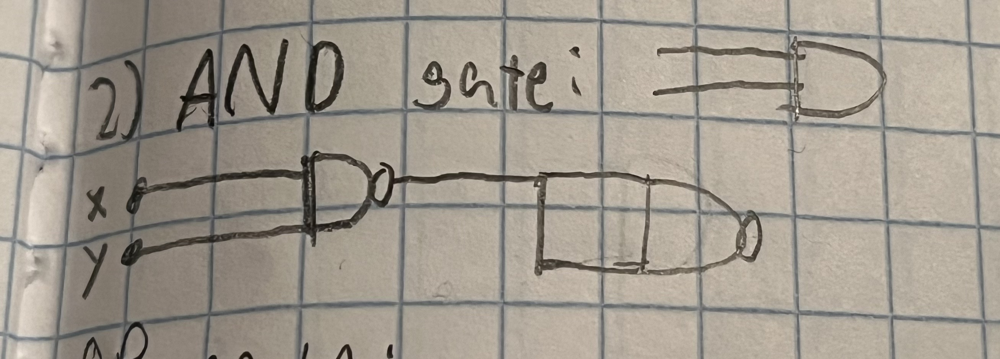
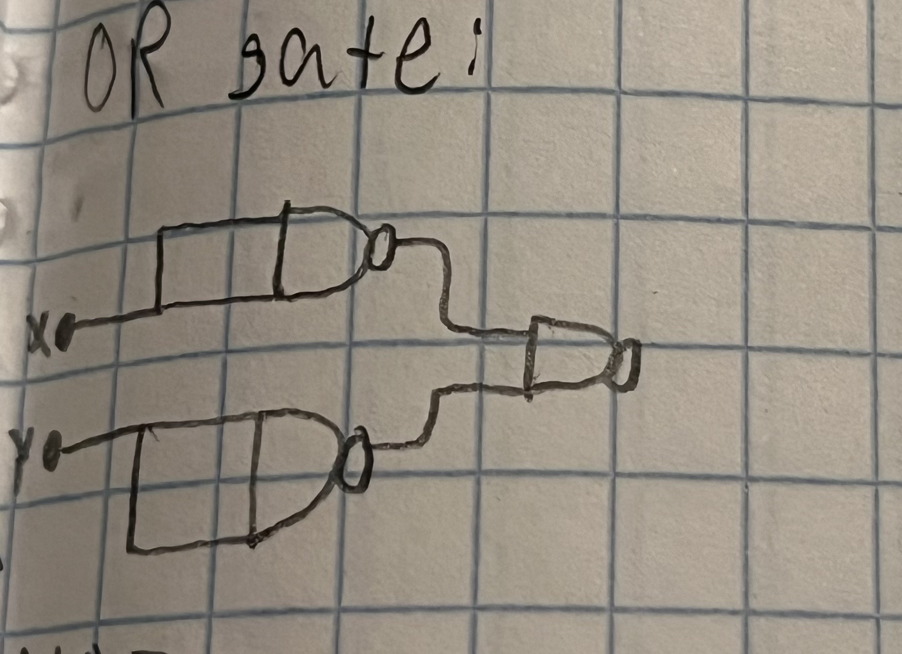
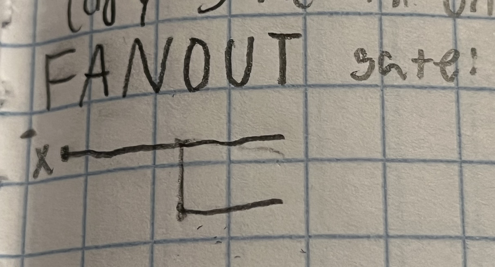

## Question 1

### part a

#### NOT gate

### part b

#### AND gate

#### OR gate

#### NOT gate

#### FANOUT gate

## Question 2
$\psi$ = $\frac{1}{\sqrt{3}}|0\rangle + \frac{i}{\sqrt{3}}|1\rangle - \frac{1}{\sqrt{3}}|2\rangle$

$\phi$ = $\frac{1}{\sqrt{2}}|1\rangle - \frac{i}{\sqrt{2}}|2\rangle$

### Give the explicit column vectors of |ψ⟩ and |φ⟩

$$ |\psi\rangle =  \frac{1}{\sqrt{3}}\begin{bmatrix}
1 \\
i \\
-1 \\
\end{bmatrix} $$

$$ |\phi\rangle =  \frac{1}{\sqrt{2}}\begin{bmatrix}
0 \\
1 \\
-i \\
\end{bmatrix} $$ 

### Calculate the following:

$\langle\psi|\psi\rangle$:

$$\langle\psi| = \frac{1}{\sqrt{3}}\begin{bmatrix}
1 -i -1
\end{bmatrix} $$

$\langle\psi|\psi\rangle$ 

= 

$$\frac{1}{\sqrt{3}}\begin{bmatrix}
1 -i -1
\end{bmatrix} 
\frac{1}{\sqrt{3}}\begin{bmatrix}
1 \\
i \\
-1 \\
\end{bmatrix}
$$

= 1

$\langle\phi|\phi\rangle$:

$$ \langle\phi| =  \frac{1}{\sqrt{2}}\begin{bmatrix}
0  & 1 & i
\end{bmatrix} $$ 

$\langle\phi|\phi\rangle$

$$ = \frac{1}{\sqrt{2}}\begin{bmatrix}
0 & 1 & i
\end{bmatrix}
\frac{1}{\sqrt{2}}\begin{bmatrix}
0 \\
1 \\
-i \\
\end{bmatrix} $$

= 1

$\langle\psi|\phi\rangle$:

$$\frac{1}{\sqrt{3}}\begin{bmatrix}
1 -i -1
\end{bmatrix}
\frac{1}{\sqrt{2}}\begin{bmatrix}
0 \\
1 \\
-i \\
\end{bmatrix} $$

= 0

$|\psi\rangle\langle\phi$:

$$ |\psi\rangle =  \frac{1}{\sqrt{3}}\begin{bmatrix}
1 \\
i \\
-1 \\
\end{bmatrix}
\frac{1}{\sqrt{2}}\begin{bmatrix}
0 & 1 & i
\end{bmatrix} $$ 

=

$$ \frac{1}{\sqrt{6}}\begin{bmatrix}
0 & 1 & i \\
0 & i &  -1 \\
0 & -1 &  -i \\
\end{bmatrix} $$

$|\phi\rangle \otimes \psi\rangle$:

$|\phi\rangle \otimes \psi\rangle$

=

$$
\frac{1}{\sqrt{3}}\begin{bmatrix}
1 \\
i \\
-1 \\
\end{bmatrix} \otimes
\frac{1}{\sqrt{2}}\begin{bmatrix}
0 \\
1 \\
-i \\
\end{bmatrix}
$$

=

$$ \frac{1}{\sqrt{6}}\begin{bmatrix}
0 \\
1 \\
-i \\
0 \\
i \\
1 \\
0 \\
-1 \\
i \\
\end{bmatrix} $$

#### Is the vector |ψ⟩ + |φ⟩ a unit vector? If not, normalize it to get a unit vector.

Let $|T\rangle = \psi\rangle + \phi\rangle$

=

$$ \frac{1}{\sqrt{3}}\begin{bmatrix}
1 \\
i \\
-1 \\
\end{bmatrix} +
\frac{1}{\sqrt{2}}\begin{bmatrix}
0 \\
1 \\
-i \\
\end{bmatrix} $$  

= 

$\frac{1}{\sqrt{3}}|0\rangle + (\frac{i}{\sqrt{3}} + \frac{1}{\sqrt{2}})|2\rangle + (-\frac{1}{\sqrt{3}} - \frac{i}{\sqrt{2}})|2\rangle$

$|||T\rangle|| = \sqrt{(\frac{1}{\sqrt{3}})^2 + (\frac{i}{\sqrt{3}} + \frac{1}{\sqrt{2}})^2 + (-\frac{1}{\sqrt{3}} - \frac{i}{\sqrt{2}})^2}$

= $\sqrt{\frac{1}{3} + (\frac{i}{\sqrt{3}} + \frac{1}{\sqrt{2}})(-\frac{i}{\sqrt{3}} + \frac{1}{\sqrt{2}}) + (-\frac{1}{\sqrt{3}} - \frac{i}{\sqrt{2}})(-\frac{1}{\sqrt{3}} + \frac{i}{\sqrt{2}})}$  

= $\sqrt{\frac{1}{3} + \frac{1}{2} + \frac{1}{3} + \frac{1}{3} + \frac{1}{2}}$ 

= $\sqrt{2}$

$|T\rangle$ is not a unit vector since the length is not one. To make $|T\rangle$ a unit vector, we must divide it by $\sqrt{2}$

$|T^{\prime}\rangle =  \frac{1}{\sqrt{2}}|T\rangle$  

=  
$\frac{1}{\sqrt{6}}|0\rangle + (\frac{i}{\sqrt{6}} + \frac{1}{2})|1\rangle + (-\frac{1}{\sqrt{6}} - \frac{i}{2})|2\rangle$

## Question 3

### Calculate the probabilities of receiving result “0” or “1” if the qubit is measured.

Let $|q\rangle = \frac{1}{\sqrt{2}}|0\rangle + \frac{e^{i\theta}}{\sqrt{2}}|1\rangle$  

The probability of measuring $|0\rangle$ or $|1\rangle$ is $(\frac{1}{\sqrt{2}})^2 + (\frac{e^{i\theta}}{\sqrt{2}})^2$  

= $\frac{1}{2} + (\frac{e^{i\theta}}{\sqrt{2}} * \frac{e^{-i\theta}}{\sqrt{2}})$    

= $\frac{1}{2}  + \frac{1}{2}$  

= 1

The probabilities of receiving result “0” or “1” if the qubit is measured is 1.

### If we first apply the Hadamard gate to the initial state |q> and then measure, what are the probabilities of receiving the “0” and “1” results as an function of θ?

Using the Hadamard gate $H$ = 

$$ \frac{1}{\sqrt{2}}\begin{bmatrix}
1 & 1 \\
1 & -1 \\
\end{bmatrix}
$$

The result of applying $H$ onto $|q\rangle$ is 

$$ \frac{1}{\sqrt{2}}\begin{bmatrix}
1 & 1 \\
1 & -1 \\
\end{bmatrix}|q\rangle
$$  

=

$$ \frac{1}{2}\begin{bmatrix}
1 \\
1 \\
\end{bmatrix} +
\frac{e^{i\theta}}{2}\begin{bmatrix}
1 \\
-1 \\
\end{bmatrix} 
$$  

=
$\frac{1}{2}(|0\rangle + |1\rangle) + \frac{e^{i\theta}}{2}(|0\rangle - |1\rangle)$

= $(\frac{1}{2} + \frac{e^{i\theta}}{2})|0\rangle + (\frac{1}{2} - \frac{e^{i\theta}}{2})|1\rangle$ 

Let $\alpha = (\frac{1}{2} + \frac{e^{i\theta}}{2}), \beta = (\frac{1}{2} - \frac{e^{i\theta}}{2})$, where $\alpha$ and $\beta$ denote the probabilities of measuring the qubit in the $|0\rangle$ and $|1\rangle$ state.

$\alpha^2 = \frac{1}{4}(1 + e^{i\theta})(1 + e^{-i\theta})$  

= $\frac{1}{4}(1 + e^{i\theta} + e^{-i\theta} + 1)$  

Using the identity $e^{i\theta} = cos(\theta) + isin(\theta)$  

$\frac{1}{4}(1 + e^{i\theta} + e^{-i\theta} + 1)$    

= $\frac{1}{4}(1 + cos(\theta) + isin(\theta) + cos(\theta) -isin(\theta) + 1)$     

= $\frac{1}{4}(2 + 2cos(\theta)) = \frac{1 + cos(\theta)}{2}$

$\alpha^2 = \frac{1 + cos(\theta)}{2}$

$\beta^2 = \frac{1}{4}(1 - e^{i\theta})(1 - e^{i\theta})$    

= $\frac{1}{4}(1 - e^{i\theta} - e^{-i\theta} + 1)$    

= $\frac{1}{4}(2 - (e^{i\theta} + e^{-i\theta}))$    

Using the equivalency $e^{i\theta} + e^{-i\theta} = 2cos(\theta)$,

$\frac{1}{4}(2 - (e^{i\theta} + e^{-i\theta}))$    

$\frac{1}{4}(2 - 2cos(\theta))$      

= $\frac{1 - cos(\theta)}{2}$

$\beta^2 = \frac{1 - cos(\theta)}{2}$

The probability of measuring the qubit in the $|0\rangle$ as a function of $\theta$ is $\alpha^2 = \frac{1 + cos(\theta)}{2}$

The probability of measuring the qubit in the $|1\rangle$ state as a function of $\theta$ is
$\beta^2$ = $\frac{1 - cos(\theta)}{2}$

## Question 4

Let $Y$ =

$$ \begin{bmatrix}
0 & -i \\
i & 0 \\
\end{bmatrix} $$

### Find two unit vectors |+y⟩, |−y⟩ such that Y |+y ⟩ = |+y ⟩, and Y |−y ⟩ = −|−y ⟩

#### Finding |+y>

Let $A = I\lambda$ =

$$ \begin{bmatrix}
\lambda & 0 \\
0 & \lambda \\
\end{bmatrix} $$

Let $B = Y - A$

= 

$$ \begin{bmatrix}
0 & -i \\
i & 0 \\
\end{bmatrix} -
\begin{bmatrix}
\lambda & 0 \\
0 & \lambda \\
\end{bmatrix} $$
 
= 

$$ \begin{bmatrix}
-\lambda & -i \\
i & -\lambda \\
\end{bmatrix} $$

$|B|$ = 0

$\lambda^2 - 1 = 0$

$\lambda = \pm 1$

Using $\lambda = 1$ in $B$ and row reducing $B$,

B =

$$ \begin{bmatrix}
-1 & -i \\
i & -1 \\
\end{bmatrix} R2 \rightarrow R2 + iR1 $$   

$$ \sim
\begin{bmatrix}
-1 & -i \\
0 & 0 \\
\end{bmatrix} R1 \rightarrow R1 * -1$$    

$$ \sim
\begin{bmatrix}
1 & i \\
0 & 0 \\
\end{bmatrix}$$    

Since $x_2$ is free, let $x_2 = t$.

$x_1 = -it$

$\overrightarrow{x}$ = 

$$ 
\begin{bmatrix}
-it \\
t \\
\end{bmatrix}$$     

= 

$$ =
t \begin{bmatrix}
-i \\
1 \\
\end{bmatrix}$$     

Let **a** =

$$ \begin{bmatrix}
-i \\
1 \\
\end{bmatrix}$$     

$||\overrightarrow{a}|| = \sqrt{2}$

Let $|+y\rangle$ = 

$$ =
\frac{1}{\sqrt{2}}\begin{bmatrix}
-i \\
1 \\
\end{bmatrix}$$     

$|||+y\rangle|| = \sqrt{( \frac{1}{2}2 )^2} = 1$

$Y|+y\rangle$ =

$$ \begin{bmatrix}
0 & -i \\
i & 0 \\
\end{bmatrix}
\frac{1}{\sqrt{2}}\begin{bmatrix}
-i \\
1 \\
\end{bmatrix}$$     
$$

=

$$ 
\frac{1}{\sqrt{2}}\begin{bmatrix}
-i \\
1 \\
\end{bmatrix}$$     

#### Finding |-y>

Using $\lambda = -1$ in $B$ and row reducing $B$,

B =

$$ \begin{bmatrix}
1 & -i \\
i & 1 \\
\end{bmatrix} R2 \rightarrow R2 - iR1 $$

$$ \sim
\begin{bmatrix}
1 & -i \\
0 & 0 \\
\end{bmatrix} 
$$

Since $x_2$ is free, let $x_2 = t$.

$x_1 = it$

$\overrightarrow{x}$ =

$$ \sim
\begin{bmatrix}
it \\
t \\
\end{bmatrix}$$

=

$$ =
t \begin{bmatrix}
i \\
1 \\
\end{bmatrix}$$     

Let **b** =

$$ =
\begin{bmatrix}
i \\
1 \\
\end{bmatrix}$$

$||\overrightarrow{b}|| = \sqrt{2}$

Let $|-y\rangle$ =

$$ =
\frac{1}{\sqrt{2}}\begin{bmatrix}
i \\
1 \\
\end{bmatrix}$$

$|||-y\rangle|| = \sqrt{( \frac{1}{2}2 )^2} = 1$

$Y|-y\rangle$ =

$$ \begin{bmatrix}
0 & -i \\
i & 0 \\
\end{bmatrix}
\frac{1}{\sqrt{2}}\begin{bmatrix}
i \\
1 \\
\end{bmatrix}$$     
$$

=

$$
\frac{1}{\sqrt{2}}\begin{bmatrix}
-i \\
-1 \\
\end{bmatrix} = -|-y\rangle$$     

$|-y\rangle$ =

$$ =
\frac{1}{\sqrt{2}}\begin{bmatrix}
i \\
1 \\
\end{bmatrix}$$

### Let U be the 2 by 2 matrix with columns |+Y ⟩ and |−Y ⟩. Is U unitary?
$U =$

$$ \frac{1}{\sqrt{2}}\begin{bmatrix}
-i & i \\
1 & 1 \\
\end{bmatrix}$$

$U^{\dagger}$ =

$$
\frac{1}{\sqrt{2}}\begin{bmatrix}
i & 1 \\
-i & 1 \\
\end{bmatrix}$$

$U^{-1}$ =

$$
\frac{\sqrt{2}}{-i - i}\begin{bmatrix}
1 & -i \\
-1 & -i \\
\end{bmatrix}$$  

=

$$
\frac{1}{-\sqrt{2}i}\begin{bmatrix}
1 & -i \\
-1 & -i \\
\end{bmatrix}$$  

$$
\frac{1}{\sqrt{2}i}\begin{bmatrix}
-1 & i \\
1 & i \\
\end{bmatrix}$$    

= 

$$
\frac{1}{\sqrt{2}}\begin{bmatrix}
i & 1 \\
-i & 1 \\
\end{bmatrix}$$    

Since $U^{\dagger} = U^{-1}$, $U$ is a unitary matrix.

### Calculate U†Y U

$U^{\dagger}YU$ 

=

$$
\frac{1}{\sqrt{2}}\begin{bmatrix}
i & 1 \\
-i & 1 \\
\end{bmatrix}
\begin{bmatrix}
0 & -i \\
i & 0 \\
\end{bmatrix}
\frac{1}{\sqrt{2}}\begin{bmatrix}
-i & i \\
1 & 1 \\
\end{bmatrix}
$$ 

$$ \frac{1}{\sqrt{2}}
\begin{bmatrix}
i & 1 \\
i & -1 \\
\end{bmatrix}
\begin{bmatrix}
-i & i \\
1 & 1 \\
\end{bmatrix}$$

=

$$ \frac{1}{2}\begin{bmatrix}
2 & 0 \\
0 & -2 \\
\end{bmatrix}$$  

=

$$
\begin{bmatrix}
1 & 0 \\
0 & -1 \\
\end{bmatrix}
$$  

