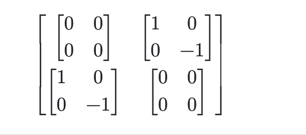
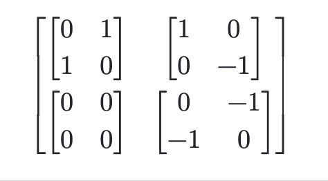

## Question 1

Let $\beta$ = $\{|A\rangle, |B\rangle\}$

### Show that rotating the basis twice by θ is the same as rotating once by an angle of 2θ

The rotation matrix $R_{\theta}$ = 

$$ \begin{bmatrix}
cos(\theta) & -sin(\theta) \\
sin(\theta) & cos(\theta) \\
\end{bmatrix} $$

Rotating $\beta$ once by $\theta$ = 

$\{cos(θ)|A⟩ + sin(θ)|B⟩, − sin(θ)|A⟩ + cos(θ)|B⟩\}$

Rotating $\beta$ once more by theta results in the new basis

$\beta^{\prime\prime}$ = $\{cos^2(θ)|A⟩ + 2sin(θ)cos(θ)|B⟩ - sin^{2}(θ)|A\rangle, −sin^2(θ)|B⟩ - 2cos(θ)sin(θ)|A⟩ + cos^2(θ)|B⟩\}$

The rotation matrix $R_{2\theta}$ = 

$$ \begin{bmatrix}
cos(2\theta) & -sin(2\theta) \\
sin(2\theta) & cos(2\theta) \\
\end{bmatrix} $$ 

=

$$ \begin{bmatrix}
cos^2(\theta) - sin^2(\theta) & -2sin(\theta)cos(\theta) \\
2sin(\theta)cos(\theta) & cos^2(\theta) - sin^2(\theta) \\
\end{bmatrix} $$ 

Applying $R_{2\theta}$ on $\beta$:

$R_{2\theta}\beta$ =

$\{|A\rangle(cos^2(\theta) - sin^2(\theta)) + |B\rangle(2sin(\theta)cos(\theta)), |A\rangle(-2sin(\theta)cos(\theta)) + |B\rangle(cos^2(\theta) - sin^2(\theta))\}$ 

= $\beta^{\prime\prime}$.

Therefore, rotating the basis twice by $\theta$ is equivalent to rotating it once by $2\theta$.

### Calculate the angle θ and number of measurements needed to reach the |1⟩ state with success probability p for some positive real number p close to 1.

Let $A\rangle = |0\rangle$ and $B\rangle = |1\rangle$.

After rotating $\beta$ once by $\theta$, we obtain that $\beta^{\prime} = (cos(θ)|A⟩ + sin(θ)|B⟩, − sin(θ)|A⟩ + cos(θ)|B⟩), with |A^{\prime}\rangle = cos(θ)|A⟩ + sin(θ)|B⟩,  |B^{\prime}\rangle = − sin(θ)|A⟩ + cos(θ)|B⟩$

Measuring $|0\rangle$ in $\beta^{\prime}$ gets us $|A^{\prime}\rangle$ 
with probability $cos^2(\theta)$, and $|B^{\prime}\rangle$ with a 
probability $sin^2(\theta)$.

As $\theta \rightarrow 0$, the probability of measuring 
the initial state in $|A^{\prime}\rangle$ grows close to 1 and
the probability of measuring the initial state in 
$|B^{\prime}\rangle$ grows close to 0.

If we can get an upper bound on the probability of failing rotating from
the $|0\rangle$ state to the $|1\rangle$ state, we can then 
get a lower bound on the lower bound on the probability of rotating to 
the $|1\rangle$ state and calculate $\theta$ and n.

To get an upper bound on the probability of failure,
we must account for all the possible cases where we make 
n -1 measurements that map to $|A^{\prime}\rangle$ and 1
measurement that maps to $|B^{\prime}\rangle$

Let $a_i$ be the event where we map to the $|B^{\prime}\rangle$ 
basis vector after i - 1 rotations.

When i = 1, $pr(a_1) = sin^2(\theta)$.

When i = 2, $pr(a_2) = cos^2(\theta)sin^2(\theta)$.

When i = 3, $pr(a_3) = cos^2(\theta)cos^2(\theta)sin^2(\theta)$.

For i = n, $pr(a_n) = cos^{2(n - 1)}(\theta)sin^2(\theta)$.

Summing all these probabilities, we can use the union-bound rule to 
state $(pr(a_1) + pr(a_2) + ... pr(a_n)) \le pr(a_1) + pr(a_2) + ... pr(a_n)$

To simplify the sum of all $p(a_i)$, we can make the observation 
that cos^{2n}(\theta) ($n \in \mathbb{Z}^{+}$) $\le 1$. This means 
that $sin^2(\theta)cos^{2n}(\theta) \le sin^2(\theta)$

When summing up each of the $p(a_i)$, we can upper bound them by
the value $sin^2(\theta)$

$(pr(a_1) + pr(a_2) + ... pr(a_n)) \le pr(a_1) + pr(a_2) + ... pr(a_n)$

The upper bound of the probability for failing to map to the $|1\rangle$ state
is $nsin^2(\theta)$.

Since we have an upper bound for the probability of failing, taking the complement 
of it will give us the lower bound for the probability of succeeding in rotating to 
$|1\rangle$.

$p = 1 - nsin^2(\theta)$

Let $n$ be the number of rotations. $n = \frac{\pi}{2\theta}$.

$1 - p = n * sin^2(\theta)$ 

$1 - p = \frac{\pi}{2\theta} * sin^2(\theta)$ 

$\frac{2(1 - p)}{\pi} = \frac{sin^2(\theta)}{\theta}$

Using the approximation $sin^2(\theta) \approx \theta^2$ when \theta is small,
when $x \rightarrow 0$.

$\frac{2(1 - p)}{\pi} = \frac{sin^2(\theta)}{\theta}$ =

$\frac{2(1 - p)}{\pi} = \frac{\theta^2}{\theta}$ =

$\frac{2(1 - p)}{\pi} = \theta$ =

Using the formula $n = \frac{\pi}{2\theta}$ and the above 
value of $\theta$,

$n = \frac{\pi^2}{1 - p}$

## Question 2
### give a protocol to distinguish with 100% accuracy between the states |ψ⟩ and |φ⟩

Let $\theta = -i\frac{3\pi}{4}$

Let $P(\theta)$ = 

$$ \begin{bmatrix}
1 & 0 \\
0 &  e^{i\theta} \\
\end{bmatrix} $$

Protocol: Apply $P(\theta)$, Hadamard gate, and then measure the 
probability of measuring the $|0\rangle$ state. If it is zero, then 
guess $\psi$, otherwise guess $\phi$

$|\psi\rangle = \frac{1}{\sqrt{2}}(e^{i\frac{\pi}{4}}|0\rangle + |1\rangle)$ 

$|\phi\rangle = \frac{1}{\sqrt{2}}(|0\rangle + e^{i3\frac{\pi}{4}}|1\rangle$

Applying the protocol on $|\psi\rangle$:

$P(\theta)|\psi\rangle = \frac{1}{\sqrt{2}}(e^{i\frac{\pi}{4}}|0\rangle + e^{-i3\frac{\pi}{4}}|1\rangle) = |A\rangle$

$H|A\rangle = \frac{1}{2}(e^{i\frac{\pi}{4}}|+\rangle + e^{-i3\frac{\pi}{4}}|-\rangle)$ 

$H|A\rangle = \frac{1}{2}((e^{i\frac{\pi}{4}} + e^{-i3\frac{\pi}{4}})|0\rangle +(e^{i\frac{\pi}{4}} - e^{-i3\frac{\pi}{4}})|1\rangle) = |C\rangle$

The probability of measuring $|0\rangle$ in $|C\rangle$:

$(\frac{1}{2})^2(e^{i\frac{\pi}{4}} + e^{-i3\frac{\pi}{4}})(e^{-i\frac{\pi}{4}} + e^{i3\frac{\pi}{4}})$

= $\frac{1}{4}(2 + e^{i\pi} + e^{-i\pi})$

Using $e^{i\theta} = cos(\theta) + isin(\theta)$

$\frac{1}{4}(2 + e^{i\pi} + e^{-i\pi})$

$= \frac{1}{4}(2 + cos(\pi) + isin(\pi) + cos(\pi) -isin(\pi))$

$= \frac{1}{4}(2 + cos(\pi) + cos(\pi))$

$= \frac{1}{4}(0) = 0$

There is a 0% probability of measuring $|0\rangle$ in $|C\rangle$ 

Applying the protocol on $|\phi\rangle$:

$P(\theta)|\phi\rangle = \frac{1}{\sqrt{2}}(|0\rangle + |1\rangle) = |D\rangle$

$H|D\rangle = \frac{1}{2}(|+\rangle + |-\rangle) = \frac{1}{2}(2|0\rangle) = |0\rangle = |E\rangle$ 

The probability of measuring $|0\rangle$ in $|E\rangle$:

$|\langle D \rangle|^2 = 1$.

We will always measure the $|0\rangle$ state in $|E\rangle$.

## Question 3

$I$ = 

$$ \begin{bmatrix}
1 & 0 \\
0 &  1 \\
\end{bmatrix} $$

$Z$ =

$$ \begin{bmatrix}
1 & 0 \\
0 &  -1 \\
\end{bmatrix} $$

$X$ =

$$ \begin{bmatrix}
0 & 1 \\
1 &  0 \\
\end{bmatrix} $$

$Y$ =

$$ \begin{bmatrix}
0 & -i \\
i &  0 \\
\end{bmatrix} $$ 

### Compute the matrices X⊗Z and Z⊗X

#### X⊗Z

$X \otimes Z$ =

$$ \begin{bmatrix}
0Z & Z \\
Z &  0Z \\
\end{bmatrix} $$  

=

#### Z⊗X

$Z \otimes X$ =

$$ \begin{bmatrix}
1X & 0X \\
0X &  -X \\
\end{bmatrix} $$  

==

### Show that the non-identity Pauli matrices anti-commute: that is, U V = −V U for every pair of X, Y , and Z matrices where U 6 = V

#### XY = -YX

$XY$ 

=

$$ \begin{bmatrix}
0 & 1 \\
1 &  0 \\
\end{bmatrix} 
\begin{bmatrix}
0 & -i \\
i &  0 \\
\end{bmatrix} $$ 

= 

$$
\begin{bmatrix}
i & 0 \\
0 &  -i \\
\end{bmatrix} $$ 

$YX$ 

=

$$\begin{bmatrix}
0 & -i \\
i &  0 \\
\end{bmatrix}
\begin{bmatrix}
0 & 1 \\
1 &  0 \\
\end{bmatrix} 
$$ 

= 

$$\begin{bmatrix}
-i & 0 \\
0 &  i \\
\end{bmatrix} $$ 

$XY = - YX$

#### XZ = -ZX
$XZ$ 

= 

$$
\begin{bmatrix}
0 & 1 \\
1 &  0 \\
\end{bmatrix}
\begin{bmatrix}
1 & 0 \\
0 &  -1 \\
\end{bmatrix} 
$$

=

$$\begin{bmatrix}
0 & -1 \\
1 &  0 \\
\end{bmatrix} $$ 

$ZX$  

$$
\begin{bmatrix}
1 & 0 \\
0 &  -1 \\
\end{bmatrix}
\begin{bmatrix}
0 & 1 \\
1 &  0 \\
\end{bmatrix}
$$

=

$$\begin{bmatrix}
0 & 1 \\
-1 &  0 \\
\end{bmatrix} $$ 

$XZ = -ZX$  

#### YZ = -ZY

$YZ$:

$$ 
\begin{bmatrix}
0 & -i \\
i &  0 \\
\end{bmatrix}
\begin{bmatrix}
1 & 0 \\
0 &  -1 \\
\end{bmatrix}
$$ 

=

$$\begin{bmatrix}
0 & i \\
i &  0 \\
\end{bmatrix} $$ 

$ZY$:

$$
\begin{bmatrix}
1 & 0 \\
0 &  -1 \\
\end{bmatrix}
\begin{bmatrix}
0 & -i \\
i &  0 \\
\end{bmatrix}
$$ 

= 

$$\begin{bmatrix}
0 & -i \\
-i &  0 \\
\end{bmatrix} $$ 

$YZ = -ZY$.

### Show that the Pauli matrices I, X, Z, Y are linearly independent

To show that the Pauli matrices are linearly independent, I must show
that the only solution to the equation $c_1I + c_2X + c_3Z + c_4Y = 0$ is
$c_1 = c_2 = c_3 = c_4 = 0$.

Using the following matrix to represent the equation above, 

$$\begin{bmatrix}
1 & 1 & 0 & 0 \\
0 &  0 & 1 & -i \\
0 &  0 & 1 & i \\
1 &  -1 & 0 & 0 \\
\end{bmatrix} $$

Row reducing it will show if there exists a non-trivial solution to the 
equation.

Row reducing the matrix above results in  

$$\begin{bmatrix}
1 & 0 & 0 & 0 \\
0 &  1 & 0 & 0 \\
0 &  0 & 1 & 0 \\
0 &  0 & 0 & 1 \\
\end{bmatrix} $$

This indicates that only the trivial solution is an answer to the equation
$c_1I + c_2X + c_3Z + c_4Y = 0$. Based on this, we can conclude that
the pauli matrices are linearly independent

### Show that the Pauli matrices form a basis for the space of 2 × 2 complex-valued matrices.
If the Pauli matrices form a basis for the space of 2 × 2 complex-valued matrices, 
then for any complex-valued matrix 

$$
\begin{bmatrix}
a & b \\
c &  d \\
\end{bmatrix}
$$

It can be composed out of a linear combination of the Pauli matrices.

Since the Pauli matrices are linearly independent and there are four 
matrices, this means they span the space of 2 x 2 complex-valued matrices.
Therefore, the Pauli matrices from a basis for the space 
of 2 × 2 complex-valued matrices.

## Question four
Let $CZ$ =

$$\begin{bmatrix}
1 & 0 & 0 & 0 \\
0 &  1 & 0 & 0 \\
0 &  0 & 1 & 0 \\
0 &  0 & 0 & 01 \\
\end{bmatrix} $$

Let $|\phi\rangle = |\psi\rangle = |0\rangle + |1\rangle$

$|\phi\rangle \otimes \psi\rangle$  

= 

$$\begin{bmatrix}
1 \\
1 \\
1 \\ 
1 \\
\end{bmatrix} $$

$CZ(|\phi\rangle = |\psi\rangle = |0\rangle)$ 

= 

$$\begin{bmatrix}
1 \\
1 \\
1 \\
-1 \\
\end{bmatrix} $$

If $CZ$ is not entangling, than we can write $CZ(|\phi\rangle = |\psi\rangle = |0\rangle)$ 
as a tensor product of two kets.

We can say that $CZ(|\phi\rangle = |\psi\rangle = |0\rangle)$  

=

$$\begin{bmatrix}
a \\
b \\
\end{bmatrix} \otimes
\begin{bmatrix}
c \\
d \\
\end{bmatrix}
$$

=

$$\begin{bmatrix}
ac \\
ad \\
bc \\
bd \\
\end{bmatrix} $$

To have this equality, we need the following conditions to hold:
* $ac$ = 1
* ad = 1
* bc = 1
* bd = -1

For $ac = 1$ to be true, both a and c must be positive or negative. 

For $ad = 1$ to be true, both a and d must be positive or negative. As
the value of a was decided in the equation above, d must have the
same sign as a.

For $bc = 1$ to be true, both b and c must be positive or negative.
Since we decided on the sign of c in the first equation, c must
have the same sign as b.

For $bd = 1$ to be true, one of b and d must be positive and the
other negative.

However, d has the same sign as a and b has the same sign
as c. Furthermore, the product of a and c is a positive value. This
implies the product of b and d is also a positive value. Since we 
cannot create this matrix out of a tensor product of two vectors,  
we know we have an entangled system. 

Since $|\phi\rangle \otimes |\psi\rangle$ is an untangled system, this 
means that $CZ$ is entangling

## Question five

$\phi\rangle = \frac{i\sqrt{2}}{\sqrt{3}}|00\rangle + \frac{1}{\sqrt{2}\sqrt{3}}|01\rangle + \frac{1}{\sqrt{2}\sqrt{3}}|10\rangle$

### Calculate the probabilities of measuring 0 or 1 in the first qubit and the resulting normalized state vector

#### probability of measuring 0 and resulting unit vector

pr(measure 0 in first qubit) =  $|\frac{i\sqrt{2}}{\sqrt{3}}|^2 +  |\frac{1}{\sqrt{6}}|^2$

pr(measure 0 in first qubit) =  $\frac{2}{3} + \frac{1}{6} = \frac{5}{6}$

The resulting state after measuring 0 in the first qubit is $\frac{i\sqrt{2}}{\sqrt{3}}|00\rangle + \frac{1}{\sqrt{6}}|01\rangle$, 
which is not a unit vector.

To make the resulting state a unit vector, I must divide by $\sqrt{\frac{5}{6}}$

Let $r^{\prime}$ be the resulting state after measuring 0 in the first 
qubit which is a unit vector.

$r^{\prime} = \frac{1}{\sqrt{\frac{5}{6}}}(\frac{i\sqrt{2}}{\sqrt{3}}|00\rangle + \frac{1}{\sqrt{2}\sqrt{3}}|01\rangle)$ 
= $r^{\prime} = \frac{1}{\sqrt{5}}(2i|00\rangle + |01\rangle)$

#### probability of measuring 1 in the first qubit and resulting unit vector

pr(measure 1 in first qubit) =  $|\frac{1}{\sqrt{6}}|^2 = \frac{1}{6}$

The resulting state after measuring 1 in the first qubit is $\frac{1}{\sqrt{6}}|10\rangle$,
which is not a unit vector.

To make the resulting state a unit vector, I must divide by $\sqrt{\frac{1}{6}}$

Let $t^{\prime}$ be the resulting state after measuring 1 in the first
qubit which is a unit vector.

$t^{\prime} = \frac{1}{\sqrt{\frac{1}{6}}}\frac{1}{\sqrt{2}\sqrt{3}}|10\rangle$ 

= $|10\rangle$

## Question six

### part one
Let $F$ = $X \otimes I \otimes I$

Let $S$ = $H \otimes I \otimes I$

Let $T$ = $CNOT \otimes I$

Let $U = TSF$

$U(\frac{1}{\sqrt{2}}(|000\rangle - |111\rangle))$ =

$TSF(\frac{1}{\sqrt{2}}(|000\rangle - |111\rangle))$ =

$TS(\frac{1}{\sqrt{2}}(|100\rangle - |011\rangle))$ =

$T(\frac{1}{2}(|-00\rangle - |+11\rangle))$ =

$T(\frac{1}{2}(|000\rangle - |100\rangle - (|011\rangle + |111\rangle)))$ =

$(\frac{1}{2}(|000\rangle - |110\rangle - (|011\rangle + |101\rangle)))$ =

$(\frac{1}{2}(|000\rangle - |110\rangle - |011\rangle - |111\rangle))$ =

$|\psi\rangle$

### part two

$|\phi\rangle$ =

$$ \begin{bmatrix}
a \\
b \\
\end{bmatrix} $$

$|\psi\rangle$ =

$$ \begin{bmatrix}
c \\
d\\
\end{bmatrix} $$

#### Show that a partial measurement of any qubit in the |ψ⟩ state leaves an entangled state in the remaining 2 qubits.

**Measuring $|0\rangle in the first qubit**

Measuring $|0\rangle$ in the first qubit leaves us the state 
$\frac{1}{2}|0\rangle \otimes (|00\rangle - |11\rangle)$
After normalizing the state, I have $\frac{1}{\sqrt{2}}|0\rangle \otimes (|00\rangle - |11\rangle)$

If the remaining qubits are entangled, this means that there exists no
$|\phi\rangle$ and $|\psi\rangle$ such that $|\phi\rangle \otimes |\psi\rangle$
= $\frac{1}{\sqrt{2}}(|00\rangle - |11\rangle)$

$\frac{1}{sqrt{2}}(|00\rangle - |11\rangle)$  =

$$ \begin{bmatrix}
\frac{1}{\sqrt{2}} \\
0\\
0\\
-\frac{1}{\sqrt{2}} \\
\end{bmatrix} $$

$|\phi\rangle \otimes |\psi\rangle$ = $\frac{1}{\sqrt{2}}(|00\rangle - |11\rangle)$  =

$$ \begin{bmatrix}
ac \\
ad \\
bc \\
bd \\
\end{bmatrix} $$

Since $ac = \frac{1}{\sqrt{2}}$, we know that neither a nor c is zero. 

From $bd = -\frac{1}{\sqrt{2}}$, we know  that neither b nor d is zero. 

However, we have that $bc = 0$. Considering the above statements, we 
can never have this property be satisfied. 

Therefore, we cannot create = $\frac{1}{\sqrt{2}}(|00\rangle - |11\rangle)$
out of a tensor product of two kets. 

**Measuring $|1\rangle$ in the first qubit**

Measuring $|1\rangle$ in the first qubit leaves us the state
$\frac{1}{2}|1\rangle \otimes(- |10\rangle - |01\rangle)$ 
After normalizing the state, I have $\frac{1}{\sqrt{2}}|1\rangle \otimes(- |10\rangle - |01\rangle)$

If measuring $|1\rangle$ in the first qubit leaves us an entangled 
state in the remaining qubits, then it should be impossible to write
$\frac{1}{\sqrt{2}}(-|10\rangle - |01\rangle)$ as a tensor product of 
$|\psi\rangle$ and $|\phi\rangle$.

$\frac{1}{\sqrt{2}}(-|10\rangle - |01\rangle)$ =

$$ \begin{bmatrix}
0 \\
-\frac{1}{\sqrt{2}}1 \\
-\frac{1}{\sqrt{2}}1 \\
0 \\
\end{bmatrix} $$

$|\phi\rangle$ =

$$ \begin{bmatrix}
a \\
b \\
\end{bmatrix} $$

$|\psi\rangle$ =

$$ \begin{bmatrix}
c \\
d\\
\end{bmatrix} $$

$|\phi\rangle \otimes |\psi\rangle$ =

$$ \begin{bmatrix}
ac \\
ad \\
bc \\
bd \\
\end{bmatrix} $$

Since $ad = -\frac{1}{\sqrt{2}}1 = bc, neither a, d, b, c can be zero.

However, we have that $ac = 0$, which is impossible given the following 
conditions. Therefore, we cannot construct
$\frac{1}{\sqrt{2}}(-|10\rangle - |01\rangle)$ as a tensor product of
$|\psi\rangle$ and $|\phi\rangle$.

**Measuring $|0\rangle$ in the second qubit**

Measuring $|0\rangle$ in the second qubit leaves us the state
$\frac{1}{2}(|000\rangle - |101\rangle)$ =
After normalizing the state, I have
$\frac{1}{\sqrt{2}}(|000\rangle - |101\rangle)$

If measuring $|0\rangle$ in the second qubit leaves us an entangled
state in the remaining qubits, then it should be impossible to write
$\frac{1}{\sqrt{2}}(|00\rangle - |11\rangle)$
 as a tensor product of $|\psi\rangle$ and $|\phi\rangle$.

$\frac{1}{\sqrt{2}}(|00\rangle - |11\rangle)$ =

$$ \begin{bmatrix}
\frac{1}{\sqrt{2}} \\
0 \\
0 \\
\frac{1}{\sqrt{2}} \\
\end{bmatrix} $$

$|\phi\rangle$ =

$$ \begin{bmatrix}
a \\
b \\
\end{bmatrix} $$

$|\psi\rangle$ =

$$ \begin{bmatrix}
c \\
d\\
\end{bmatrix} $$

$|\phi\rangle \otimes |\psi\rangle$ =

$$ \begin{bmatrix}
ac \\
ad \\
bc \\
bd \\
\end{bmatrix} $$

Since $ac = \frac{1}{\sqrt{2}} = bd, this means a, c, b, d cannot be zero.

The second equation, ad = 0, contradicts the aforementioned properties
of a, b, c, and d. Therefore, we cannot write

$\frac{1}{\sqrt{2}}(|00\rangle - |11\rangle)$
as a tensor product of $|\psi\rangle$ and $|\phi\rangle$.

**Measuring $|1\rangle$ in the second qubit**

Measuring $|1\rangle$ in the second qubit leaves us the state
$\frac{1}{2}(- |110\rangle - |011\rangle)$
After normalizing the state, I have $\frac{1}{\sqrt{2}}|0\rangle (-|110\rangle - |011\rangle)$

If the remaining qubits are entangled, this means that there exists no
$|\phi\rangle$ and $|\psi\rangle$ such that $|\phi\rangle \otimes |\psi\rangle$ =
$\frac{1}{\sqrt{2}}|0\rangle (-|10\rangle - |01\rangle)$

$\frac{1}{\sqrt{2}}(- |10\rangle - |01\rangle)$  =

$$ \begin{bmatrix}
0 \\  
-\frac{1}{\sqrt{2}} \\ 
-\frac{1}{\sqrt{2}} \\ 
0 \\ 
\end{bmatrix} $$

$|\phi\rangle \otimes |\psi\rangle$ = $\frac{1}{\sqrt{2}}(- |10\rangle - |01\rangle)$ =

$$ \begin{bmatrix}
ac \\
ad \\
bc \\
bd \\
\end{bmatrix} $$

From this system, we know that $ad = -\frac{1}{\sqrt{2}}, bc = -\frac{1}{2}$. 
This indicates none of a, b, c, or d is zero.

These properties contradict with the equation $ac = 0$. Therefore, we 
cannot write
$\frac{1}{\sqrt{2}}(- |10\rangle - |01\rangle)$
as a tensor product of $|\psi\rangle$ and $|\phi\rangle$.

**Measuring $|0\rangle$ in the third qubit**

Measuring $|0\rangle$ in the third qubit leaves us the state
$\frac{1}{2}( |000\rangle - |110\rangle)$
After normalizing the state, I have $\frac{1}{\sqrt{2}}(|000\rangle - |110\rangle)$

If the remaining qubits are entangled, this means that there exists no
$|\phi\rangle$ and $|\psi\rangle$ such that $|\phi\rangle \otimes |\psi\rangle$ =
$\frac{1}{\sqrt{2}}( |00\rangle - |11\rangle)$

$\frac{1}{\sqrt{2}}( |00\rangle - |11\rangle)$  =

$$ \begin{bmatrix}
\frac{1}{\sqrt{2}} \\
0\\
0\\
-\frac{1}{\sqrt{2}} \\
\end{bmatrix} $$

$|\phi\rangle \otimes |\psi\rangle$ = $\frac{1}{\sqrt{2}}( |00\rangle - |11\rangle)$   =

$$ \begin{bmatrix}
ac \\
ad \\
bc \\
bd \\
\end{bmatrix} $$

From this system, we know that $ac = \frac{1}{\sqrt{2}}, bc = -\frac{1}{2}$.
This indicates none of a, b, c, or d is zero.

These properties contradict with the equation $ac = 0$. Therefore, we
cannot write
$\frac{1}{\sqrt{2}}( |00\rangle - |11\rangle)$  
as a tensor product of $|\psi\rangle$ and $|\phi\rangle$.

**Measuring $|1\rangle$ in the third qubit**
Measuring $|1\rangle$ in the third qubit leaves us the state
$\frac{1}{2}(- |101\rangle - |011\rangle)$
After normalizing the state, I have $\frac{1}{\sqrt{2}}(- |101\rangle - |011\rangle)$

If the remaining qubits are entangled, this means that there exists no
$|\phi\rangle$ and $|\psi\rangle$ such that $|\phi\rangle \otimes |\psi\rangle$
$\frac{1}{\sqrt{2}}(- |10\rangle - |01\rangle)$

$\frac{1}{\sqrt{2}}(- |10\rangle - |01\rangle)$

$$ \begin{bmatrix}
0 \\  
-\frac{1}{\sqrt{2}} \\
-\frac{1}{\sqrt{2}} \\
0 \\
\end{bmatrix} $$

$|\phi\rangle \otimes |\psi\rangle$ = $\frac{1}{\sqrt{2}}(- |10\rangle - |01\rangle)$

$$ \begin{bmatrix}
ac \\
ad \\
bc \\
bd \\
\end{bmatrix} $$

From this system, we know that $ad = -\frac{1}{\sqrt{2}}, bc = -\frac{1}{2}$.
This indicates none of a, b, c, or d is zero.

These properties contradict with the equation $ac = 0$. Therefore, we
cannot write
$\frac{1}{\sqrt{2}}(- |10\rangle - |01\rangle)$
as a tensor product of $|\psi\rangle$ and $|\phi\rangle$.

### Compute the parity a⊕b⊕c = a+b+c mod 2 of the measurement results if

Let $Q = \frac{1}{2}(|000\rangle + |110\rangle - |011\rangle - |101\rangle)$

Let $G$ be the following gate composition: $H \otimes H \otimes I$

Let $F$ be the following gate composition: $I \otimes H \otimes H$

Let $T$ be the following gate composition: $H \otimes I \otimes H$
#### All qubits are measured in the {0, 1} basis.

For $|000\rangle$, we measure zero for each qubit, summing to 
zero for the measurement result.

For $|110\rangle$, we measure two ones and a zero, summing to
two for the measurement result.

$a + b + c \bmod{2} = 2 \bmod{2}  = 0$

For $|011\rangle$, we measure two ones and a zero, summing to
two for the measurement result.

For $|101\rangle$, we measure two ones and a zero, summing to
two for the measurement result.

In total, we sum 6 for the measurement result, with a parity of zero.

#### Qubits 0 and 1 are measured in the {|+⟩, |−⟩} basis and qubit 2 in the {0, 1} basis.

Applying $G onto (|000\rangle - |110\rangle - |011\rangle - |101\rangle),
we obtain $|++0\rangle - |--0\rangle$ - |+-1\rangle$ - |-+1\rangle$  
= $(|0\rangle + |1\rangle)(|0\rangle + |1\rangle)0\rangle) - (|(|0\rangle - |1\rangle)(|0\rangle - |1\rangle)0\rangle) - (|0\rangle + |1\rangle)(|0\rangle - |1\rangle)1\rangle$) - ((|0\rangle - |1\rangle)(|0\rangle + |1\rangle)1\rangle)$ =

$\frac{1}{4}((|000\rangle + |010\rangle + |100\rangle + |110\rangle) - (|000\rangle - |010\rangle - |100\rangle + |110\rangle) - (|001\rangle + |011\rangle - |101\rangle - |111\rangle) - (|001\rangle - |011\rangle + |101\rangle - |111\rangle))$

= $\frac{1}{2}(|010\rangle + |100\rangle  + |001\rangle + |111\rangle)$

The measurements sum to 6.

The parity is 0.

#### Qubits 0 and 2 are measured in the {|+⟩, |−⟩} basis and qubit 1 in the {0, 1} basis.

For $|000\rangle$,
let us apply $T$ onto $Q$.

We obtain $\frac{1}{4}(|+0+\rangle - |-1+\rangle - |+1-\rangle - |-0-\rangle)$ =

$$
\frac{1}{4}(((|0\rangle + |1\rangle)0(|0\rangle + |1\rangle)) -
(|(|0\rangle - |1\rangle)1(|0\rangle + |1\rangle)) -
(|(|0\rangle + |1\rangle)1(|0\rangle - |1\rangle)) -
(|(|0\rangle - |1\rangle)0(|0\rangle - |1\rangle)))
$$

=

$\frac{1}{4}(|000\rangle + |001\rangle + |100\rangle + |101\rangle -(|010\rangle + |011\rangle - |110\rangle - |111\rangle) - (|010\rangle - |011\rangle + |110\rangle - |111\rangle) - (|000\rangle - |001\rangle - |100\rangle + |101\rangle))$

=

$\frac{1}{2}(|001\rangle + |100\rangle + |111\rangle + |001\rangle)$

The resulting measurement is 6.

The parity is 0.

### Qubits 1 and 2 are measured in the {|+⟩, |−⟩} basis and qubit 0 in the {0, 1} basis.

let us apply $F$ onto $Q$.

We obtain $\frac{1}{4}(|0++\rangle  - |1-+\rangle - |0--\rangle - |1+-\rangle)$ =

$\frac{1}{4}(|0(|0\rangle + |1\rangle)(|0\rangle + |1\rangle)\rangle) - (|1(|0\rangle - |1\rangle)(|0\rangle - |1\rangle)\rangle) -(|0(|0\rangle - |1\rangle)(|0\rangle - |1\rangle)) + (|1(|0\rangle + |1\rangle)(|0\rangle - |1\rangle))$

= $\frac{1}{4}((|000\rangle + |001\rangle + |010\rangle + |011\rangle) - (|100\rangle + |101\rangle - |110\rangle - |111\rangle) - (|000\rangle - |001\rangle - |010\rangle + |011\rangle) - (|100\rangle - |101\rangle + |110\rangle - |111\rangle))$

= $\frac{1}{2}((|001\rangle + |010\rangle + |100\rangle + |111\rangle))$

The resulting sum for the measurement 
is 6.

The parity of this case is 0.
### Denote the measurement result of qubit i in the {0, 1} basis by ai, and in the {|+⟩, |−⟩} basis by bi. Is it possible that each ai and bi has a pre-determined value independent of which basis the other qubits are measured in? Give a convincing argument for your answer

Let us have a state $\phi$ which can either be $|00\rangle$ or 
$|11\rangle$

If each qubit can have pre-determined values independent of
how the other qubits are measured, this means that no matter how 
I measure the first qubit of $\phi$, the second qubit should always 
have the measured values $a_2$ and $b_2$. 

Since $a_2$ is measured in the computational basis, that means it 
can have measurement values $|0\rangle$ or $|1\rangle$.

In the case where $a_2$ has the measurement $|0\rangle$, I should 
be able to measure the first qubit and still obtain  $|0\rangle$
when measuring the second qubit. 

However, if I measure the $|1\rangle$ state for my first qubit, 
this affects the state of the second qubit. If the $|1\rangle$ 
state is the first qubit, then $\phi$ must be  
$|11\rangle$.

Similarily, if $a_2$ had the measurement $|1\rangle$,
measuring the $|0\rangle$ state for my first qubit
affects the state of the second qubit and fixes $|\phi\rangle$ as
$|00\rangle$.

Since the state I measure from the first qubit impacts the state of the
second qubit, this means each $a_i$ and $b_i$ is not independent from the 
other $a_is$ and $b_is$.

### Give a quantum strategy (i.e. a strategy where involving a shared pre-entangled state) for a 3-player game where Alice, Bob, and Charlie are each given one bit x, y, and z respectively, and have to return a single bit a, b, c respectively such that a ⊕ b ⊕ c = a ∨ b ∨ c Hint: use the state |ψ⟩ as the initial shared state
Alice, Charlie, and Bob receive a bit with value 0 or 1.

Let us construct a gate out of the results of the bits 
that Alice, Charlie, and Bob receive.

Let $G_1$, $G_2$, $G_3$ be the gates corresponding to Alice, Charlie, and
Bob respectively.

For each of the $G_i$, let $G_i$ be $H$ if Alice, 
Charlie, and Bob receive the bit one. Let $G_i$ be $I$ otherwise.

Let the composition of $G_1$, $G_2$, $G_3$ be $G$ =
$G_1 \otimes G_2 \otimes G_3$.

For our strategy, we will have everyone receive their bit and measure their corresponding qubit 
with their appropriate gates. When they measure, they will report back their results to 
the referee.

Since we know that at most two of Alice, Charlie, and Bob 
receive the bit one and that the results are the same in 
cases where two out of the three bits are one, 
we can analyze only two cases to conclude our strategy is valid.

Case 1: Alice, Charlie, and Bob all receive a bit 0.
In this case, everyone measures in the computational basis.

When doing this, the following states are measured each with a probability of 
$\frac{1}{4}: $|000\rangle, |110\rangle, |011\rangle, |101\rangle$

For each of the states measured, all values of  $a \oplus b \oplus c$ return 0, consistent for what 
$x \lor y \lor z$ evaluates to.

Let $|\psi\rangle = \frac{1}{2}(|000\rangle + |110\rangle - |011\rangle - |101\rangle)$

Case 2: Two of Alice, Charlie, and Bob receive a bit 1.
If Alice and Charlie receive the bit one, then $|\psi\rangle$ is measured using 
$G$ and we obtain $\frac{1}{2}(|010\rangle + |100\rangle  + |001\rangle + |111\rangle)$ (refer to question six, part 3b for the calculation).

For each of the states measured, all values of  $a \oplus b \oplus c$ return 1, consistent for what
$x \lor y \lor z$ evaluates to.

By symmetry, we know that the strategy working for one of the scenarios where two of Alice, Charlie, and Bob receive a bit 1
means that it works for the other scenarios in this category.

Therefore, our strategy works on all types of valid inputs, assuring us that we always win the game.
