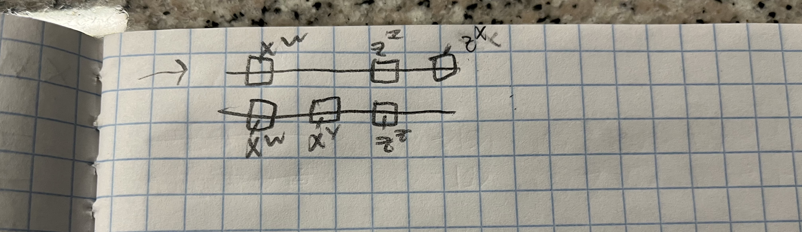

## Question 1

**Let P = |ψ⟩⟨ψ|. Compute (I − 2P )|ψ⟩ and (I − 2P )$|ψ^⊥⟩$**

$(I - 2p)|\psi\rangle:$

$(I - 2p)|\psi\rangle$

$= |\psi\rangle - 2(|ψ⟩⟨ψ|\psi\rangle)$

= $|\psi\rangle - 2|\psi\rangle$ 

= $-|\psi\rangle$

$(I - 2p)||\psi\rangle^{\dagger}:$

$(I - 2p)||\psi\rangle^{\dagger}$ 

$= |\psi\rangle^{\dagger} - 2(|ψ⟩⟨ψ|\psi\rangle^{\dagger})$

$= |\psi\rangle^{\dagger} - 0$

= $|\psi\rangle^{\dagger}$

**Show that (I − 2|ψ⟩⟨ψ|) is unitary whenever |ψ⟩ is a unit vector.**

Let $U = (I − 2|ψ⟩⟨ψ|)$. If $U$ is unitary, then it means
that $U^{\dagger} = U^{-1}$.

$|\psi\rangle =$

$$
\begin{bmatrix}
a + bi \\
c + di \\
\end{bmatrix} 
$$

$\langle\psi| =$

$$
\begin{bmatrix}
a - bi & c - di \\
\end{bmatrix}
$$

$U^{\dagger} = I^{\dagger} - 2|\psi\rangle^{\dagger}\langle\psi|^{\dagger}$
$U^{\dagger} = I - 2|\psi\rangle\langle\psi| = U$

Applying $U^{\dagger}$ onto $U$, we have $U^2$ 

$= (I - 2|\psi\rangle\langle\psi|)(I - 2|\psi\rangle\langle\psi|)$

= $I - 4|\psi\rangle\langle\psi| + 4(|\psi\rangle\langle\psi||\psi\rangle\langle\psi|)$

Since $|\psi\rangle$ is a unit vector, it means that $\langle\psi|\psi\rangle = 1$

$I - 4|\psi\rangle\langle\psi| + 4(|\psi\rangle\langle\psi||\psi\rangle\langle\psi|)$

= $I - 4|\psi\rangle\langle\psi| + 4|\psi\rangle\langle\psi|$ 

= $I$

Since  $U^{\dagger}U = I$, we have shown that U is unitary whenever $|\psi\rangle$ is a unit 
vector.

**What is the geometric interpretation of the transformation I − 2|0⟩⟨0| in $R^2$**

For any $|\psi\rangle$ we apply the transformation on, we will receive 
$|\psi\rangle - 2|0\rangle\langle0|\psi\rangle$

$\langle0|\psi\rangle$ tells us how much $\psi\rangle$ projects onto the x axis. Let $k$ be the 
factor denoting how much \psi\rangle$ projects onto the x-axis.

With $|\psi\rangle - 2|0\rangle\langle0|\psi\rangle$, this becomes
$|\psi\rangle - 2k|0\rangle$.

This tells us that we are taking the negation of the x coordinate of $|\psi\rangle$, which is 
equivalent to a relection over the y-axis. 

The geometric interpretation of the transformation is that it performs a reflection over the 
y-axis.

**Does the transformation I − 2|0⟩⟨0| have a similar geometric interpretation in the Bloch sphere? Why or why not**

Any point on the bloch sphere can be represented as $cos(\theta)|0\rangle + e^{i\phi}sin(\theta)$.

When applying an arbitrary point on the block sphere to the transformation, we obtain
$cos(\theta)|0\rangle + e^{i\phi}sin(\theta) - 2cos(\theta)|0\rangle = -cos(\theta)|0\rangle + e^{i\phi}sin(\theta) $.

$-cos(\theta)|0\rangle + e^{i\phi}sin(\theta) = e^{i\pi}(cos(\theta)|0\rangle + e^{i(\phi - \pi)}sin(\theta))$

Referring to the diagram of the bloch sphere, we know that rotating $\phi$ by $\pi$ is 
equivalent to rotating 180 degrees with respect to the z-axis.

## Question two

### How is a parity measurement of two qubits different from measuring both bits in the computational basis and then taking their parity?
A parity measurement of two qubits is a partial measurement that projects
to the 0 parity or 1 parity subspace. It changes the state, but the superposition 
is still maintained and we have uncertainty.

A parity measurement of two qubits after measuring both bits in the computational basis 
projects both onto the computational basiS, removing any uncertainty we had before.
When we then take the parity measurement of this, there no uncertainty when we project 
onto one of the parity subspaces.

The parity measurement of two qubits differs from measuring both bits in the computational basis and then taking their parity since
you may potentially change the state of the qubit by measuring in the computational basis. By
doing this and then measuring the parity, you can receive different values than if you had 
measured the parity using the given basis.

### Devise a circuit using CN OT gates and computational basis measurement which measures the parity of two qubits without measuring either qubit itself.
Measure the ancilla qubit after in the computational basis. If it is 0, then the parity of 
the two other qubits is 0.

If not, the parity of the two other qubits is 1.

There are three cases to consider for the circuit:
* Both of the first two qubits are 0 
* Only one of the first two qubits are 1
* Both of the first two qubits are 0

**Case 1: both qubits are 0**

If both qubits are zero, then the ancilla bit will not be turned on and will return us 
0 for the parity of the other two qubits. This matches the actual parity.

**Case 2: Only one of the qubits are 1**

The ancilla bit will be turned on by the bit that is in the one state, and will have nothing
done to it by the other bit. 

Measuring the ancilla bit, we will obtain 1, which is the parity of the first two qubits.

**Case 3: both of the qubits are 1**

The ancilla bit will be turned on by one bit and will be turned off by the other bit.

Measuring the ancilla bit, we will obtain 0, which is the parity of the first two qubits.

## Question three

### Calculate the density matrix of {( 1√2 |0⟩ + 1√2 |+⟩, 1)}

The density matrix would be $(\frac{1}{\sqrt{2}}|0⟩ + \frac{1}{\sqrt{2}}|+⟩) (\frac{1}{\sqrt{2}}\langle 0| + \frac{1}{\sqrt{2}}\langle +|)$

= $\frac{1}{2}(|0\rangle \langle 0| + |0\rangle \langle +| + |+\rangle \langle 0| + |+\rangle \langle 0|)$

= $\frac{1}{2}(|0\rangle (\langle 0| + \langle +|) + |+\rangle (\langle 0| + \langle +|))$ =

$$ \frac{1}{2}
\begin{bmatrix}
1 + \frac{1}{\sqrt{2}} & \frac{1}{\sqrt{2}} \\
0 & 0 \\
\end{bmatrix} +
\begin{bmatrix}
1 + \frac{1}{\sqrt{2}} & 1 \\
1 + \frac{1}{\sqrt{2}}  & 1 \\
\end{bmatrix} 
$$

-1 + i/sqrt(2)
i/sqrt(2) + 1/2 
1/2

### {(|0⟩, 1/2 ), (|+⟩, 1/2 )}

The density matrix would be $\frac{1}{2}|0\rangle\langle0| + \frac{1}{2}|+\rangle\langle+|$

$\frac{1}{2}|0\rangle\langle0| + \frac{1}{2}|+\rangle\langle+|$ =

$$\frac{1}{2}
\begin{bmatrix} 
\frac{3}{2} & \frac{1}{2} \\
\frac{1}{2} & \frac{1}{2} \\
\end{bmatrix}
$$

=

$$
\begin{bmatrix}
\frac{3}{4} & \frac{1}{4} \\
\frac{1}{4} & \frac{1}{4} \\
\end{bmatrix}
$$

### (|00⟩, 1/2 ), (|01⟩, 1/4 ), (|10⟩, 1/4 )}

The density matrix would be $\frac{1}{4}(2|00\rangle\langle00| + |01\rangle\langle01| + |10\rangle\langle10|)$

$\frac{1}{4}(2|00\rangle\langle00| + |01\rangle\langle01| + |10\rangle\langle10|)$  

= 

$$ \frac{1}{4} 
2\begin{bmatrix}
1 & 0 & 0 & 0\\
0 & 0 & 0 & 0  \\
0 & 0 & 0 & 0  \\
0 & 0 & 0 & 0  \\
\end{bmatrix} 
\begin{bmatrix}
0 & 0 & 0 & 0\\
0 & 1 & 0 & 0  \\
0 & 0 & 0 & 0  \\
0 & 0 & 0 & 0  \\
\end{bmatrix} 
\begin{bmatrix}
0 & 0 & 0 & 0\\
0 & 0 & 0 & 0  \\
0 & 0 & 1 & 0  \\
0 & 0 & 0 & 0  \\
\end{bmatrix} 
$$
= 

$$\frac{1}{4}
\begin{bmatrix}
2 & 0 & 0 & 0\\
0 & 1 & 0 & 0  \\
0 & 0 & 1 & 0  \\
0 & 0 & 0 & 0  \\
\end{bmatrix} 
$$

### Question four

We can represent the density matrix 

$$
\frac{1}{2}
\begin{bmatrix}
0 & 0 & 0 & 0\\
0 & 1 & -1 & 0  \\
0 & -1 & 1 & 0  \\
0 & 0 & 0 & 0  \\
\end{bmatrix}
$$

as $\frac{1}{2}(|01\rangle\langle01| - |01\rangle\langle10| - |10\rangle\langle01| + |10\rangle\langle10|)$

$\frac{1}{2}(|01\rangle\langle01| - |01\rangle\langle10| - |10\rangle\langle01| + |10\rangle\langle10|)$

= 

$$
\frac{1}{2}(|0\rangle\langle0| \otimes |1\rangle\langle1| - 
|0\rangle\langle1| \otimes |1\rangle\langle0| -
|1\rangle\langle0| \otimes |0\rangle\langle1| +
|0\rangle\langle0| \otimes |1\rangle\langle1|)
$$

Tracing out the first qubit, we have 

$$
\frac{1}{2}(\langle0|0\rangle \otimes |1\rangle\langle1| -
\langle1|0\rangle \otimes |1\rangle\langle0| -
\langle0|1\rangle \otimes |0\rangle\langle1| +
\langle1|1\rangle \otimes |0\rangle\langle0|)
$$

= $\frac{1}{2}(|1\rangle\langle1| + |0\rangle\langle0|)$

The reduced density matrix of the second qubit is $\frac{1}{2}(|1\rangle\langle1| + |0\rangle\langle0|)$

## Question five 

Show that $p = {\displaystyle\sum_{i=1}^{n}} p_i|\theta_i\rangle\langle\theta_i|$ is positive-semidefinite.

To show that ${\displaystyle\sum_{i=1}^{n}} p_i|\theta_i\rangle\langle\theta_i|$ is positive-semidefinite, than
\forall $|V\rangle$ of appropriate dimension, $\langle V p V\rangle$ must be non-negative.

$\langle V p V\rangle$  =

${\displaystyle\sum_{i=1}^{n}} p_i|\langle V |\theta_i\rangle \langle \theta_i | V\rangle$ 

Let $\langle V| \theta_i \rangle =  \langle\theta_i|V\rangle = k_i$

${\displaystyle\sum_{i=1}^{n}} p_i|\theta_i\langle V| \theta_i \rangle\langle\theta_i|V\rangle$  =

${\displaystyle\sum_{i=1}^{n}} p_i|{k_{i}}^2$. 

$\forall k_i \in \mathbb{R}, {k_i}^2 \geq 0$

Considering that all the probabilities are non-zero and that every ${k_i}^2 \geq 0$, 
this implies that ${\displaystyle\sum_{i=1}^{n}} p_i|{k_i}^2$ will sum to a non-negative value.

Since this occurs for any $|V\rangle$, $p$ is positive-semidefinite.

## Question six

Let $G = {\displaystyle\sum_{i=1}^{n}} |e_i\rangle\langle e_i| \otimes I$.

$P^{AB} = {\displaystyle\sum_{i, j, e, k}^{}} p_{ijek} |e_i\rangle\langle e_j| \otimes |f_e\rangle \langle f_k|$

$P^B = {\displaystyle\sum_{i, j, e, k}^{}} p_{ijek} \text{Tr}(|e_i\rangle\langle e_j|) \otimes |f_e\rangle \langle f_k|$

$P^B = {\displaystyle\sum_{i, j, e, k}^{}} p_{ijek} \text{Tr}(\langle e_j|e_i\rangle) \otimes |f_e\rangle \langle f_k|$

$P^B = {\displaystyle\sum_{i, e, k}^{}} p_{iiek} \text{Tr}(\langle e_i|e_i\rangle) \otimes |f_e\rangle \langle f_k|$

Since we can choose any basis to write Alice's density matrix in, let us chose to write it 
in the basis used for the partial measurement.

Applying the partial measurement on Alice's qubit, we have

${\displaystyle\sum_{i}^{}}  Tr((|e_i\rangle \langle e_i| \otimes I) P^{AB}(|e_i\rangle \langle e_i| \otimes I))$

= ${\displaystyle\sum_{i}^{}}Tr((|e_i\rangle \langle e_i| \otimes I)(|e_i\rangle \langle e_i| \otimes I) P^{AB})$

= ${\displaystyle\sum_{i}^{}}Tr((|e_i\rangle \langle e_i|)(|e_i\rangle \langle e_i|) \otimes I^2) P^{AB})$

= ${\displaystyle\sum_{i}^{}}Tr((|e_i\rangle \langle e_i|) \otimes I) P^{AB})$

= ${\displaystyle\sum_{i}^{}}Tr((|e_i\rangle \langle e_i|) \otimes I) P^{AB})$

= ${\displaystyle\sum_{i, j, e, k, f}^{}} p_{ijekf} \text{Tr}(|e_i\rangle \langle e_j| |e_f\rangle\langle e_f|) \otimes |f_e\rangle \langle f_k|$

= ${\displaystyle\sum_{i, j, e, k, f}^{}} p_{ijek} \text{Tr}(\langle e_f||e_i\rangle \langle e_j| |e_f\rangle) \otimes |f_e\rangle \langle f_k|$

Since I sum over the basis vectors in $H_A$, lets consider the case where 
$|e_j\rangle = |e_i\rangle$ and $|e_i\rangle \neq |e_j\rangle$.

If $|e_j\rangle$ is different from $|e_i\rangle$, then we know that at least one of the 
inner products of $(\langle e_f||e_i\rangle)$ or $(\langle e_j| |e_f\rangle)$ will be zero
since either $\langle e_j| \text{is orthogonal to}|e_f\rangle \text{or}\langle e_f| \text{is orthogonal to} |e_i\rangle$.

If $|e_j\rangle = |e_i\rangle$, then we know that we will 
obtain this term  $p_{ijek} \text{Tr}(\langle e_f||e_i\rangle \langle e_j| |e_f\rangle) \otimes |f_e\rangle \langle f_k|$
since we are projecting over all the basis vectors in $H_A$, and $|e_j\rangle$ is one of them. 

Since we will only keep the terms where $|e_f\rangle = |e_i\rangle = |e_j\rangle$, our summation above becomes 

$P^{B^{\prime}} = {\displaystyle\sum_{i, e, k}^{}} p_{iijk} \text{Tr}(\langle e_i |e_i\rangle) \otimes |f_e\rangle \langle f_k|$

$P^{B^{\prime}} = P^{B}$

## Question seven

### Describe a procedure by which Alice and Bob could apply a CNOT gate to their pair of qubits — i.e. CN OT (|ψ⟩ ⊗ |ϕ⟩)

I can give both Alice and Bob part of an entangled EPR pair. 

Then, I will have Alice measure her two qubits in the Bell basis and then send 
the results to Bob. Then, Bob can apply the suitable transformations to change his 
qubit in the EPR pair to $|\psi\rangle$. 

After, Bob can then apply a CNOT gate between his qubit in the EPR pair and $|\phi\rangle$.

### Part 2

Using the provided equalities regarding CNOT gates and Z and X gates, I transformed the original circuit into

.

From here, we can determine the values of a, b, c, and d as functions of x, y, w, and z.

For a, we can see it is dependent on $w$, so $a = w$.
For b, it is dependent on $z$ and $x$. We have that $b = z \oplus x$
For c, it is dependent on $w$ and $y$. We have that $c = w \oplus y$
For d, it is dependent on $z$. We have that $d = z$

### Explain why the following circuit would implement a CNOT gate on the state |ψ⟩|ϕ⟩

Let Alice be the person holding $|\psi\rangle$.

Let Bob be the person holding $|\phi\rangle$.

Let the first EPR pair be the one that is closest to $|\psi\rangle$

Let the second EPR pair be the one that is closest to $|\phi\rangle$

When Alice measures her qubit and the first qubit of the first EPR pair in the 
Bell basis, she can send over bits $W$ and $X$ which indicate what must be 
done to the second qubit in the first EPR in order to change its state to equal
$|\psi\rangle$.

When Bob measures his qubit and the second qubit of the second EPR pair in the
Bell basis, he can send over bits $Y$ and $Z$ which indicate what must be
done to the first qubit in the second EPR in order to change its state to equal
$|\phi\rangle$.

Since we have copied the states $|\psi\rangle$ and $|\phi\rangle$ over to the second qubit of the 
first EPR pair and the first qubit of the second EPR pair respectively, applying a CNOT gate on the second 
qubit of the first EPR pair and the first qubit of the second EPR pair will 
result in $CNOT(|\psi\rangle |\phi\rangle)$

### Explain why the circuit below where a, b, c, d are the functions of w, x, y, z you gave in part 3 implements a remote CN OT between their qubits — that is, applies CN OT (|ψ⟩ ⊗ |ϕ⟩) without Alice or Bob physically teleporting their qubits to one another.

When we transpose the circuit we had in part two to the entangled state $|\Delta\rangle$, we obtain
.

After cancelling out the two $CNOT$ gates at the beginning, we obtain
.

When Alice takes her half of the entangled state and measures the first two qubits in the 
Bell basis, she can copy over her state to the second qubit in $\Delta$ by sending 
bits a and b over, which represent the transformations which need to occur in order 
to obtain $|\psi\rangle$. 

When Bob takes his half of the entangled state and measures the first two qubits in the
Bell basis, he can copy over his state to the third qubit in $\Delta$ by sending
bits c and d over, which represent the transformations which need to occur in order
to obtain $|\phi\rangle$. 

At that point, we now have in bits 2 and 3 of $\Delta$ $|\psi\rangle$ and $|\phi\rangle$ 
respectively.

When we apply a CNOT gate on the second and third bit in $\Delta$ after copying Alice's and Bob's state 
over, it is the equivalent to $CNOT(|\phi\rangle |\psi\rangle)$.

Although we did not teleport the qubits over physically to either Alice or Bob, we were 
still able to apply a remote CNOT by having them share portions of an entangled state.