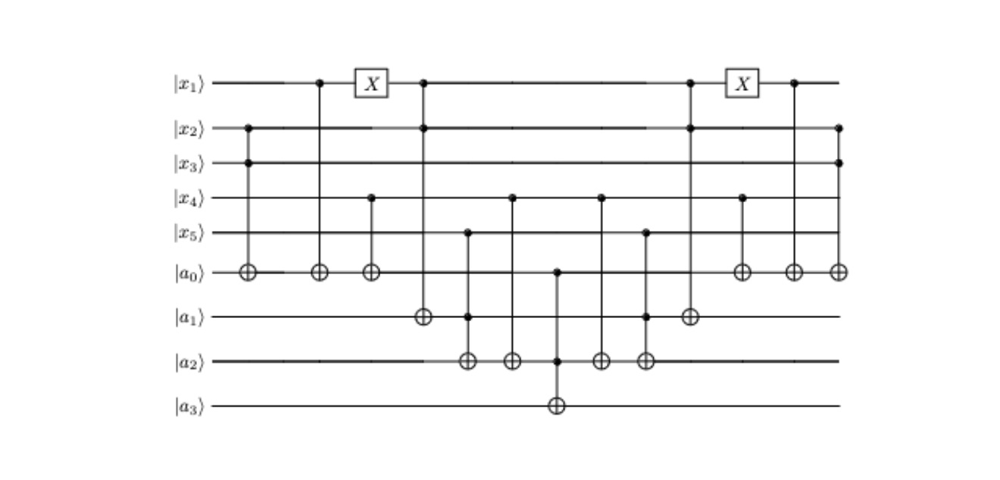

## Question 1
### Prove that approximation error is subadditive — that is, show that for any gates U1 , U2 , V1 , V2 , E(U2U1, V2V1) ≤ E(U2, V2) + E(U1, V1) You may use without proof two facts: the triangle inequality ||A + B|| ≤ ||A|| + ||B|| and ||UA|| = ||A|| = ||AU|| for any unitary U and complex valued matrix A.

Given my initial state $E(U_2U_1, V_2V_1) = ||U_2U_1 - V_2V_1||$, I can express the last expression 
as $||U_2U_1 + (-V_2V_1)||$.

I can modify the expression further to be $||(U_2U_1 - V_2U_1) + (V_2U_1 -V_2V_1)||$.
I can apply the triangle inequality and say that $||(U_2U_1 - V_2U_1) + (V_2U_1 -V_2V_1)|| \le$
$||(U_2U_1 - V_2U_1)|| + ||(V_2U_1 -V_2V_1)||$.

In order to prove that approximation error is subadditive, I must convert
$||(U_2U_1 - V_2U_1)|| + ||(V_2U_1 -V_2V_1)||$ to
$||U_2 - V_2|| + ||U_1 - V_1||$.

I can manipulate $||U_2U_1 - V_2U_1||$ by noting that it is equivalent to
$||(U_2 - V_2)U_1||$. If I let $(U_2 - V_2) = A$ and $U_1 = U$, then I can apply the fact
that ||UA|| = ||A|| = ||AU|| to obtain that $||(U_2 - V_2)U_1|| = ||U_2 - V_2|| = E(U_2, V_2)$

I can apply a similar procedure to manipulate $||(V_2U_1 -V_2V_1)||$. Noting that
$||V_2U_1 -V_2V_1|| = ||V_2(U_1 -V_1)||$, I can let $(U_1 -V_1) = A$ and $V_2 = U$ and 
apply the fact I used previously. Doing that results in  $||(V_2U_1 -V_2V_1)||$ being equal to
$||U_1 - V_1|| = E(U_1, V_1)$.

Using the work in the two sections above, we can say that 
$||(U_2U_1 - V_2U_1)|| + ||(V_2U_1 -V_2V_1)|| = E(U_2, V_2) + E(U_1, V_1)$.
Knowing this, we can substitute the new value of $||(U_2U_1 - V_2U_1)|| + ||(V_2U_1 -V_2V_1)||$
into the expression $||(U_2U_1 - V_2U_1) + (V_2U_1 -V_2V_1)|| \le$
$||(U_2U_1 - V_2U_1)|| + ||(V_2U_1 -V_2V_1)||$, obtaining
$||(U_2U_1 - V_2U_1) + (V_2U_1 -V_2V_1)|| \le  E(U_2, V_2) + E(U_1, V_1)$.

### Suppose you have a circuit U1 · · · Uk consisting of k gates and you wish to approximate over some particular gate set to an error of ε. What approximation factor should you choose for each gate?

Using what we just proved above, we know that the error of approximating the k gates is bounded 
by the expression $E(U_1, V_1) + E(U_2, V_2) + .... + E(U_k, V_k)$. For the preceding expression to
be less than or equal to $\epsilon$, we must have the error in each gate be $x$, where $x \le \frac{\epsilon}{k}$.
In the scenario where $x = \frac{\epsilon}{k}$, the sum of all the approximation errors is $\epsilon$. For 
other values of $x$, the sum of the approximation errors is smaller.

## Question two

### Part 1
|0⟩⟨0| ⊗ I + |1⟩⟨1| ⊗ U

Let $t, r$ be two arbitrary qubits where $t = a|0\rangle + b|1\rangle$, r = c|0\rangle + d|1\rangle$, $a, b, c, d \in \mathbb{c}$.

$|tr\rangle = ac|00\rangle + ad|01\rangle + bc|10\rangle + bd|11\rangle$.

Applying (|0⟩⟨0| ⊗ I + |1⟩⟨1| ⊗ U) to $|tr\rangle$, we obtain
(|0⟩⟨0| ⊗ I + |1⟩⟨1| ⊗ U)($ac|00\rangle + ad|01\rangle + bc|10\rangle + bd|11\rangle$). 
After applying |0⟩⟨0| ⊗ I + |1⟩⟨1| ⊗ U to each term, we obtain
$ac|00\rangle + ad|01\rangle + bc|1(U|0\rangle)\rangle + bd|1(U|1\rangle)\rangle$.

This proves that |0⟩⟨0| ⊗ I + |1⟩⟨1| ⊗ U functions as a controlled U gate for any arbitrary two 
qubits.

### Part 2

The circuit in matrix form would be $|0\rangle \langle 0| \otimes I \otimes I$
+ $|1\rangle \langle 1| \otimes I \otimes H$

## Question three

### Gate controlled on a measurement

Let $t, r$ be two arbitrary qubits where $t = a|0\rangle + b|1\rangle$, r = c|0\rangle + d|1\rangle$, $a, b, c, d \in \mathbb{c}$.

Let us have $t$ be the control bit and $r$ be the target bit.

We measure $|0\rangle$ in the control bit with a probability of $a^2$. Since we do not apply the 
$U$ gate, the joint state of $t$ and $r$ is $ac|00\rangle + ad|01\rangle$

We measure $|1\rangle$ in the control bit with a probability of $b^2$. Since we do apply the
$U$ gate, the joint state of $t$ and $r$ is $bc|1(U|1\rangle)\rangle + bd|1(U|0\rangle)\rangle$

### Quantum controlled gate 
Let $t, r$ be two arbitrary qubits where $t = a|0\rangle + b|1\rangle$, r = c|0\rangle + d|1\rangle$, $a, b, c, d \in \mathbb{c}$.

Let us have $t$ be the control bit and $r$ be the target bit.

The joint state of $r$ and $t$ is $ac|00\rangle + ad|01\rangle + bc|10\rangle + bd|11\rangle$.

After applying the $c-U$ gate, the joint state of $r$ and $t$ is
$ac|00\rangle + ad|01\rangle + bc|1(U|0\rangle)\rangle + bd|1(U|1\rangle)\rangle$ 
= $a|0\rangle(c|0\rangle) + d|1\rangle) + b|1\rangle(cU|0\rangle + dU|1\rangle)$

If we now measure $t$ in the classical basis, we obtain
$a|0\rangle(c|0\rangle) + d|1\rangle)$ with probability $|a|^2|(|c|^2 + |d|^2) = |a|^2$  
(since we are given that $|c|^2 + |d|^2 = 1$ from the fact that r is an arbitrary qubit) and
$b|1\rangle(cU|0\rangle + dU|1\rangle)$ with probability $|b|^2(|c|^2 + |d|^2) = |b|^2$.

If we compare the measurement results of the quantum controlled and classically controlled gate, 
we notice that they match. 

Therefore, every gate controlled on a measurement outcome is equivalent to a quantum 
controlled gate followed by a measurement.

## Question four

## Question five

### Part 1
Let $f(x) = x$. If we apply this on 
$\frac{1}{\sqrt{2}}(|00\rangle + |10\rangle)$, we obtain
$\frac{1}{\sqrt{2}}(|00\rangle + |11\rangle)$, which is $|B_{00}\rangle$, which we know is 
entangled.

### Part 2 

Let the state after applying f be S = $f(H|0\rangle)$.

If we measure the second qubit in the computational basis, we obtain 
$|00\rangle$ or $|11\rangle$. 

Before, the first qubit was in a superposition of the $|0\rangle$ and $|1\rangle$ state. After 
measuring the second qubit, we have removed the superposition and fixed the state of 
the first qubit to match the second.

### Part 3
If the temporary value is unentangled with no
other qubit, then we can measure it without any affect on the other qubits.

However, measuring the qubit when it is entangled could affect the value of the larger 
computation we performed.

As a result, this could affect the results of further values
which depended on what was obtained from the large computation, resulting in the function 
outputting incorrect values.

## Question six

### Part 1
Since I wish to compute the dot product modulo 2 of s and x, I only need to apply four 
CNOT gates where $x_2, x_4, x_5$ and $x_6$ act as the control bit and the target bit is the 
ancilla. I do not need CNOT gates on $x_1$ and $x_3$ since the product of $x_1s_1$ and 
$x_3s_3$ will be zero regardless (since $s_1 = s_3 = 0$).

After applying the above operations, I obtain the state
$|x\rangle |f(x)\rangle$.

### Part 2
I will now list the state of the input state and the ancilla after each time slice.

The first time slice: the state is $|x\rangle | f(x)\rangle$.

The second time slice: the state is $(-1)^{f(x)} |x\rangle | f(x)\rangle$.

The third time slice: the state is $(-1)^{f(x)} |x\rangle |0\rangle$.

### Part 3

For n = 6, I only need to check over 6 possible states. For each state, I apply either 
$U_f$ or $U_f(I \otimes Z)U_f$. Since $U_f$ is composed of four CNOT gates and assuming that 
CNOT and Z run in O(n) time, I can say that the work done on each state is O(n). 

Summing up the total work on n states, I would have O(n) work done n times, having a 
runtime of $O(n^2)$.

### Do you think query complexity is a good characterization of the problem in this case?

I think query complexity is not the proper tool of analysis for this problem 
since it does not give us sufficient information to determine whether a speedup has occurred. 

Looking into the implementation of the oracle allows us to compare the classic and 
quantum algorithm to analyze the benefits/drawbacks of the quantum function.

### What if instead Uf was any polynomial-sized oracle for f over the gate set consisting of X, CNOT, and Toffoli gates, with no other gaurantees about its structure?
Given these conditions that each call to $U_f$ takes runtime $O(n^k), k \in \mathbb{R}$, 
running the algorithm n times will give us a total runtime of $O(n^{k + 1})$, which is 
still polynomial.

## Question seven
f (a, b, c) = (b(¬a) + b(¬c), b(a ⊕ c), ac).
### Part 1

The uniform superposition is 
$\frac{1}{\sqrt{2^n}}{\displaystyle\sum_{x \in \{0, 1\}^3}{}} |x \rangle |f(x)\rangle$

= $\frac{1}{\sqrt{2^3}}(|000\rangle |000\rangle + |001 \rangle |000\rangle + |011\rangle |110\rangle  + |010 \rangle |000\rangle  +  |100\rangle |000\rangle + |101 \rangle |001\rangle + |111 \rangle |001\rangle  + |110 \rangle |110\rangle)$

### Part 2

I have three values of f(x) present: $|001\rangle, |000\rangle,$ and $|110\rangle$.

I will now do a partial measurement of $|110\rangle$ in the second register.

Doing the above, I obtain
$\frac{1}{\sqrt{2}}(|011\rangle |110\rangle  + |110 \rangle |110\rangle)$

### Part 3

Applying $H^{\otimes 3}$ onto $\frac{1}{\sqrt{2}}(|011\rangle |110\rangle  + |110 \rangle |110\rangle)$, 
I obtain 

$\frac{1}{4}(|+--\rangle |110\rangle  + |--+\rangle |110\rangle)$. Expanding this expression out, we obtain

$\frac{1}{4}((|000\rangle - |001\rangle - |010\rangle + |011\rangle + |100\rangle - |101\rangle - |110\rangle + |111\rangle)|110\rangle$  + 

$(|000\rangle + |001\rangle - |010\rangle - |011\rangle - |100\rangle - |101\rangle + |110\rangle + |111\rangle)|110\rangle)$, which 
simplifies to $\frac{1}{4}(2(|000\rangle - |010\rangle -|101\rangle + |111\rangle)) = \frac{1}{2}(|000\rangle - |010\rangle -|101\rangle + |111\rangle)$ 

### Part 4
For my two linearly independent vectors, I shall pick $|010\rangle$ and $|111\rangle$.

### Part 5
Solving the system $As = 0$, I start off with

$$
\begin{bmatrix}
0 & 1 & 0  \space |0\\
1 & 1 & 1 \space |0 \\
0 & 0 & 0 \space |0 \\
\end{bmatrix}
$$.

Row reducing this matrix, I obtain

$$
\begin{bmatrix}
1 & 0 & 1 \space |0\\
0 & 1 & 0 \space |0 \\
0 & 0 & 0 \space |0 \\
\end{bmatrix}
$$.

From the matrix, I see that $x_2 = 0$ and that $x_1 = -x_3$. Since I want a non-trivial solution, I let 
$x_3 = 1$, which means that $x_1 = 1 = -1$ mod $2$. As a result, I have that $x_1x_2x_3 = 101$, which is my hidden 
string.
