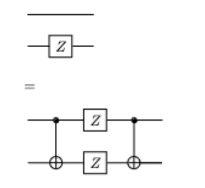

## Question 1

### Part 1
I must show that $(X \otimes Z) * (Z \otimes X) = (Z \otimes X) * (X \otimes Z)$.

Using the fact that $XZ = -ZX$, I can modify the above expression to equivalently 
be $(-Z \otimes X) * (Z \otimes X) = (Z \otimes X) * (-Z \otimes X)$. I can pull out the 
constant of $-1$ from both sides of the equation to obtain
$-1((Z \otimes X) * (Z \otimes X)) = -1((Z \otimes X) * (Z \otimes X))$.

I have therefore showed that $(X \otimes Z)$ and $(Z \otimes X)$ are commutative.

### Part 2

Given $U(t) = e^{-i\hat{H}t} = e^{-it[{\theta}_1 (Z \otimes X) + {\theta}_2 (X \otimes Z)]}$, we can break it further
down into $e^{-it[{\theta}_1 (Z \otimes X)]} *  e^{-it[{\theta}_2 (X \otimes Z)]}$ since $(X \otimes Z)$ and $(Z \otimes X)$ commute.

Given $U(t) = $e^{-it[{\theta}_1 (Z \otimes X)]} *  e^{-it[{\theta}_2 (X \otimes Z)]}$, we can simulate the 
Hamiltonian by first applying $e^{-it[{\theta}_2 (X \otimes Z)]}$  and then $e^{-it[{\theta}_1 (Z \otimes X)]}$.

With $e^{-it[{\theta}_2 (X \otimes Z)]}$, we know that it is equivalent to
$e^{-it[{\theta}_2 ((H \otimes I) * (Z \otimes I) * (H \otimes Z))]}$. Simulating this hamiltonian on 
a circuit, we obtain 
, where 
the third line was obtained using the fact that .

Simulating $e^{-it[{\theta}_1 (Z \otimes X)]}$ in a circuit, we know it 
is equivalent to $e^{-it[{\theta}_1 ((Z \otimes H) * (I \otimes Z) * (I \otimes H))]}$. In circuit form, it 
would be , where
the third line was obtained using the fact that .

Combining these Hamiltonians, the full circuit simulating
$U(t) = $e^{-it[{\theta}_1 (Z \otimes X)]} *  e^{-it[{\theta}_2 (X \otimes Z)]}$
is 

### Part 3
Using $c = 1.5, \epsilon = 10^{-17}$ in the formula depth = $log_{2}^{1.5} (\frac{1}{\epsilon})$, I obtain 
depth = $log^{1.5}_{2} (\frac{1}{10^{-17}}) \approx 425$ for a single qubit unitary. Considering we 
have two usages of the rotation gate, we have in total a depth of 850 gates for the circuit.

### Part 4
For a general vector eigenvector $q$ of $(X \otimes Z)$ and $(Z \otimes X)$, we know q is of the form 

$$
\begin{bmatrix}
a \\
b \\
c \\
d \\
\end{bmatrix}
$$

Applying $(X \otimes Z)q$, we find that $q$ is the eigenvector corresponding to the eigenvalue of 1 if 

$$
\begin{bmatrix}
a \\
b \\
c \\
d \\
\end{bmatrix} = 
\begin{bmatrix} c \\
-d \\ 
a \\ 
-b 
\end{bmatrix}$$.

If $q$ is the eigenvector corresponding to the eigenvalue of -1, it means that  

$$(X \otimes Z)
\begin{bmatrix}
a \\
b \\
c \\
d \\
\end{bmatrix} =
\begin{bmatrix}
-c \\
d \\
-a \\
b
\end{bmatrix}$$.

## Question two

### Part 1

Given that $H$ and $M$ are given, my search function $f(x): \set{0, 1}^{32} \rightarrow \set{0, 1}$ would 
be $f(x) = h(x) = H \land x \neq M$.

To implement the oracle, I would first create my uniform superposition $H^{\otimes 32} |0\rangle^{\otimes 32}$. I would
then apply my $U_{\bar{f}}: |x\rangle \rightarrow (-1)^{f(x)}$, using $f(x)$ defined earlier, and $U_{diff}$ enough 
times to rotate our initial to the wanted state. We then measure 

### Part 2
Using that we need $\frac{\pi \sqrt{2^n}}{4} - \frac{1}{2}$ iterations for n bits, we can 
substitute n for 32 in the aforementioned expression. We obtain $\frac{\pi \sqrt{2^{32}}}{4} - \frac{1}{2} = \frac{\pi 2^{16}}{4} - \frac{1}{2}$. 
This simplifies to $\pi 2^{14}- \frac{1}{2}$, which tells us we need $\pi 2^{14}- \frac{1}{2} \approx \pi 2^{14} - 1$ many iterations.

### Part 3

After k rotations, our current state is $sin((2k + 1)\theta) |\phi_{good}\rangle + cos((2k + 1)\theta) |\phi_{bad}\rangle$.
The probability I am in the good state is $sin^2((2k + 1)\theta)$. Using $k = 2^14 \pi - \frac{1}{2}$ discovered in the 
last question and $\theta = sin^{-1} \frac{1}{2^{16}}$, I obtain that $sin^2((2k + 1)\theta) = sin^2((2^15 - 2)sin^{-1} \frac{1}{2^{16}}) = 1$.

The approximate probability of success is 1.

Make a note about how this probability was obtained using the limited precision of the calculator.

## Question three

Let us define $|0\rangle _L = \frac{1}{\sqrt{2}}(|00\rangle + |11\rangle), |1\rangle _L = \frac{1}{\sqrt{2}}(|01\rangle + |10\rangle)$.

Applying $(X \otimes X)$ on $|0\rangle _L$, we obtain $(X \otimes X)\frac{1}{\sqrt{2}}(|00\rangle + |11\rangle) = \frac{1}{\sqrt{2}}(|11\rangle + |00\rangle) = |0\rangle _L$.

Applying $(X \otimes X)$ on $|1\rangle _L$, we obtain $(X \otimes X)\frac{1}{\sqrt{2}}(|01\rangle + |10\rangle) = \frac{1}{\sqrt{2}}(|10\rangle + |01\rangle) = |1\rangle _L$.

If the bit flips are independent, then we transform $|0\rangle _L$ to $|1\rangle _L$ and $|1\rangle _L$ to $|0\rangle _L$. This 
occurs since our subspace protected against the errors caused by $(X \otimes X)$ by mapping one state in the superposition to
the other state in the superposition. With independent bit flips, the error maps a state in $|0\rangle _L$ to 
a state in $|1\rangle _L$, and vice versa. 
