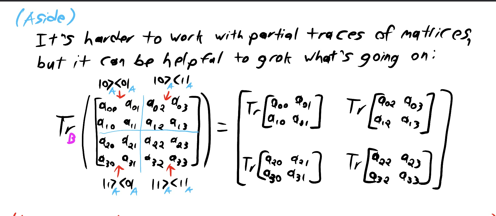

Universality:   
* A gate set is universal (for classical computing) if $\forall n, m > 0$, any circuit can be constructed out of these gates

Correlated:
* A distribution is correlated if it cannot be written as the tensor product of two other states. it is Separable otherwise
* Similar to entanglement

Probability vector: 
* A vector where all the probabilities in the vector sum to 1
* Each probability is non-negative

Hermitian conjugate:
* Take the conjugate of the vector and then take the complex conjugate of each entry

Unitary:
* Hermitian conjugate is equal to its inverse
* Norm preserving

Projectors:
* An operator P with the property that $P^2$ = P pf

Partial measurement:
* Only measure and keep the states which have a qubit in the position you are looking at
* Normalize the resulting vector so it becomes a unit vector

Local operations:
* Measurements or operations done to a single qubit

Projective measurements: 
* Send a state $|\psi\rangle$ to $\frac{P_i|\psi\rangle}{\sqrt{p(i)}}$, where $p(i) = \langle\psi|P_i|\psi\rangle$

Hermitian:
* An operator p where $p^{\dagger} = p^{-1} = p$

Density matrix:
* Alternate representation of a mixed state
* All entries along the diagonal sum to 1
* Defined as $p = {\displaystyle\sum_{i}^{}} p_i|\theta_i\rangle\langle\theta_i|$
* Applying a unitary $U$ on the density matrix sends p to $UpU^{\dagger}$

Cyclicity of the trace:
* $Tr(ABC) = Tr(CAB) = Tr(BCA)$

Reduced density operations:
* Local unitaries do not change the reduced density matrix.
* $P^{AB} = {\displaystyle\sum_{i, j, e, k}^{}} p_{ijek} |e_i\rangle\langle e_j| \otimes |f_e\rangle \langle f_k|$
* $P^B = {\displaystyle\sum_{i, j, e, k}^{}} p_{ijek} \text{Tr}(|e_i\rangle\langle e_j|) \otimes |f_e\rangle \langle f_k|$
* We can choose any basis to write the denisty matrix in

No Communication Theorem:
* If Alice and Bob share an entangled state, a local unitary applied on Alice's/Bob's qubit does not affect the reduced density matrix of the other person

Rotations:
* You can simulate any rotation through three rotations over two non-parallel axes.

* If you are rotating a point by $\pi$, in the bloch sphere you end up rotating by $2\pi$.
* You can obtain the antipodal point to any point by taking the same state, placing it at $\pi - \theta$, and then rotating by a degree of $\pi$ degrees around the z-axis. 
* That is why if you had $sin(\frac{\theta}{2})$, the antipodal point would be $sin(\frac{\pi - \theta}{2})$

